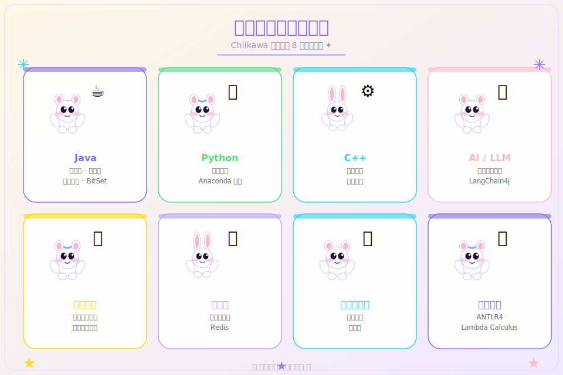
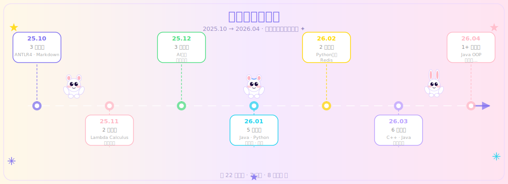

<div align="center">


# CodeNote · 编程知识笔记

> 一份持续生长的开源编程知识库，记录从 2025 年 10 月起的系统性学习轨迹。  
> 涵盖 Java · Python · C++ · AI · 操作系统 · 数据库 · 计算机网络 · 编译原理等核心领域。

[](https://worldguigui.github.io/github-claw/)
[](https://worldguigui.github.io/github-claw/)
[](https://worldguigui.github.io/github-claw/)
[](LICENSE)
[](https://github.com/worldguigui/codenote)

[🌐 导航官网](https://worldguigui.github.io/github-claw/) · [📦 笔记仓库](https://github.com/worldguigui/codenote) · [⭐ 点个 Star](#)

</div>

---

## ✨ 项目简介

**CodeNote** 是一个面向在校大学生和自学程序员的开源编程知识库，由 [@worldguigui](https://github.com/worldguigui) 从 2025 年 10 月开始持续记录和整理。内容覆盖计算机科学核心课程及工程实践，每篇笔记力求**系统、精炼、实用**。

本仓库还提供一个**高颜值导航官网**（[worldguigui.github.io/github-claw](https://worldguigui.github.io/github-claw/)），让知识检索变得优雅：

- 🔍 **全文搜索** — 实时按关键字过滤笔记
- 📅 **按月索引** — 清晰的时间线视图，一览学习轨迹
- 📊 **增长图表** — Chart.js 可视化笔记增长趋势
- ✨ **精致 UI** — 深色玻璃态设计、粒子背景、流畅动效
- 📱 **响应式** — 完美适配桌面与移动端

---

## 📚 涵盖领域



| 领域 | 核心内容 | 笔记数 |
|:---:|:---|:---:|
| ☕ **Java** | 包装类 · 字符串 · 面向对象编程 · BitSet 源码解析 | 5 |
| 🐍 **Python** | 基础语法 · Anaconda 环境配置 | 2 |
| ⚙️ **C++** | 基础语法 · 竞赛 I/O 优化技巧 | 2 |
| 🤖 **AI / LLM** | 人工智能导论 · LangChain4j 初级开发 | 2 |
| 🖥️ **操作系统** | 操作系统原理 · 计算机硬件综合课设 | 2 |
| 🗄️ **数据库** | 数据库原理 · Redis 实践 | 2 |
| 🌐 **计算机网络** | 网络基础 · 协议栈 | 1 |
| 🔤 **编译原理** | ANTLR4 基础 · ANTLR4 高级 · Lambda Calculus · Markdown | 4 |

---

## 🗺 学习旅程



从 2025 年 10 月项目启动，到 2026 年 4 月持续添加，共 7 个月、22 篇笔记，每一篇都是真实学习的印记。

---

## 📖 全部笔记索引

### 🔤 2025.10 — 起点：编译器基础

| 笔记 | 链接 |
|:---|:---|
| ANTLR4 基础 | [📄 查看](https://github.com/worldguigui/codenote/blob/main/25.10/antlr4%E5%9F%BA%E7%A1%80.md) |
| ANTLR 部署与快速入门 | [📄 查看](https://github.com/worldguigui/codenote/blob/main/25.10/antlr%E9%83%A8%E7%BD%B2%E4%B8%8E%E5%BF%AB%E9%80%9F%E5%85%A5%E9%97%A8.md) |
| Markdown 基本语法 | [📄 查看](https://github.com/worldguigui/codenote/blob/main/25.10/markdown%E5%9F%BA%E6%9C%AC%E8%AF%AD%E6%B3%95.md) |

### 🔢 2025.11 — 理论探索

| 笔记 | 链接 |
|:---|:---|
| The Lambda Calculus | [📄 查看](https://github.com/worldguigui/codenote/blob/main/25.11/the%20lambda%20calculus.md) |
| 常用开源项目简介 | [📄 查看](https://github.com/worldguigui/codenote/blob/main/25.11/%E5%B8%B8%E7%94%A8%E5%BC%80%E6%BA%90%E9%A1%B9%E7%9B%AE%E7%AE%80%E4%BB%8B.md) |

### 🤖 2025.12 — 系统级知识

| 笔记 | 链接 |
|:---|:---|
| ANTLR4 高级·属性与动作 | [📄 查看](https://github.com/worldguigui/codenote/blob/main/25.12/antlr4%E9%AB%98%E7%BA%A7-%E5%B1%9E%E6%80%A7%E4%B8%8E%E5%8A%A8%E4%BD%9C) |
| 人工智能导论 | [📄 查看](https://github.com/worldguigui/codenote/blob/main/25.12/%E4%BA%BA%E5%B7%A5%E6%99%BA%E8%83%BD%E5%AF%BC%E8%AE%BA.md) |
| 操作系统原理 | [📄 查看](https://github.com/worldguigui/codenote/blob/main/25.12/%E6%93%8D%E4%BD%9C%E7%B3%BB%E7%BB%9F%E5%8E%9F%E7%90%86.md) |

### ☕ 2026.01 — 工程全栈

| 笔记 | 链接 |
|:---|:---|
| BitSet 源码解析 | [📄 查看](https://github.com/worldguigui/codenote/blob/main/26.1/BitSet%E6%BA%90%E7%A0%81%E8%A7%A3%E6%9E%90.md) |
| LangChain4j 初级开发 | [📄 查看](https://github.com/worldguigui/codenote/blob/main/26.1/LangChain4j%E5%88%9D%E7%BA%A7%E5%BC%80%E5%8F%91.md) |
| Python 与 Anaconda 安装 | [📄 查看](https://github.com/worldguigui/codenote/blob/main/26.1/Python%E4%B8%8EAnaconda%E7%9A%84%E5%AE%89%E8%A3%85.md) |
| 数据库原理 | [📄 查看](https://github.com/worldguigui/codenote/blob/main/26.1/%E6%95%B0%E6%8D%AE%E5%BA%93%E5%8E%9F%E7%90%86.md) |
| 计算机网络 | [📄 查看](https://github.com/worldguigui/codenote/blob/main/26.1/%E8%AE%A1%E7%AE%97%E6%9C%BA%E7%BD%91%E7%BB%9C.md) |

### 🐍 2026.02 — 编程语言强化

| 笔记 | 链接 |
|:---|:---|
| Python 基础 | [📄 查看](https://github.com/worldguigui/codenote/blob/main/26.2/Python%E5%9F%BA%E7%A1%80.md) |
| Redis | [📄 查看](https://github.com/worldguigui/codenote/blob/main/26.2/Redis.md) |

### ⚙️ 2026.03 — 多线突破

| 笔记 | 链接 |
|:---|:---|
| C++ 基础 | [📄 查看](https://github.com/worldguigui/codenote/blob/main/26.3/C%2B%2B%E5%9F%BA%E7%A1%80.md) |
| Java 基础·包装类 | [📄 查看](https://github.com/worldguigui/codenote/blob/main/26.3/Java%E5%9F%BA%E7%A1%80-%E5%8C%85%E8%A3%85%E7%B1%BB.md) |
| Java 基础·字符串 | [📄 查看](https://github.com/worldguigui/codenote/blob/main/26.3/Java%E5%9F%BA%E7%A1%80-%E5%AD%97%E7%AC%A6%E4%B8%B2.md) |
| 三维模型制作 | [📄 查看](https://github.com/worldguigui/codenote/blob/main/26.3/%E4%B8%89%E7%BB%B4%E6%A8%A1%E5%9E%8B%E5%88%B6%E4%BD%9C.md) |
| 计算机硬件综合课设 | [📄 查看](https://github.com/worldguigui/codenote/blob/main/26.3/%E8%AE%A1%E7%AE%97%E6%9C%BA%E7%A1%AC%E4%BB%B6%E7%B1%BB%E7%BB%BC%E5%90%88%E6%80%A7%E8%AF%BE%E8%AE%BE.md) |
| 面试总结 | [📄 查看](https://github.com/worldguigui/codenote/blob/main/26.3/%E9%9D%A2%E8%AF%95%E6%80%BB%E7%BB%93.md) |

### 🚀 2026.04 — 持续生长

| 笔记 | 链接 |
|:---|:---|
| Java 基础·面向对象编程（完整版）| [📄 查看](https://github.com/worldguigui/codenote/blob/main/26.4/Java%E5%9F%BA%E7%A1%80-%E9%9D%A2%E5%90%91%E5%AF%B9%E8%B1%A1%E7%BC%96%E7%A8%8B.md) |
| 更多内容持续添加中… | — |

---

## 🌐 导航官网功能

### 🔍 智能搜索

在时间线顶部输入关键字，即时过滤所有笔记标签，无需翻页。

### 📊 增长趋势图

基于 Chart.js 的折线图，直观展示每月笔记数量变化，见证知识积累的轨迹。

### 🎨 精致视觉设计

| 设计细节 | 说明 |
|:---|:---|
| 深色玻璃态 | 暗色背景 `#07080f` + 半透明卡片，护眼优雅 |
| 主色调 | 紫色 `#7c6df0` + 青色 `#22d3ee` + 绿色 `#4ade80` |
| 粒子背景 | 60 个浮动粒子，Canvas 原生实现，性能优秀 |
| 渐变光晕 | 两个装饰 blob 缓慢漂移，增添空间感 |
| 阅读进度条 | 页面顶部彩色进度条，跟踪阅读位置 |
| 回到顶部 | 滚动 400px 后出现，点击平滑回顶 |
| 淡入动画 | IntersectionObserver 驱动的 fade-up 效果 |
| 计数动画 | 数字从 0 滚动到目标值，吸引眼球 |

### 📱 响应式布局

- 桌面端：完整导航 + 宽屏布局
- 移动端：简化导航 + 紧凑卡片排列

---

## 🚀 快速开始

### 访问导航官网

直接打开：**[worldguigui.github.io/github-claw](https://worldguigui.github.io/github-claw/)**

### 本地运行

```bash
# 克隆仓库
git clone https://github.com/worldguigui/github-claw.git

# 进入目录
cd github-claw

# 用任意 HTTP 服务器打开（推荐）
npx serve .
# 或直接用浏览器打开 index.html
open index.html
```

### 查阅笔记

前往 [codenote 笔记仓库](https://github.com/worldguigui/codenote) 查看 Markdown 格式原文。

---

## 📈 项目数据

```
总笔记数：22 篇
持续时长：7 个月（2025.10 — 2026.04）
技术领域：8 个
最高产月：2026.03（6 篇）
平均每月：~3.1 篇
开源协议：MIT
```

---

## 🤝 贡献指南

欢迎任何形式的贡献！

1. **发现错误** — 提交 [Issue](https://github.com/worldguigui/codenote/issues) 指出笔记中的错误或过时内容
2. **补充内容** — Fork 仓库，修改后发起 Pull Request
3. **建议主题** — 在 Issues 中提议你希望看到的笔记主题
4. **点个 Star** ⭐ — 最简单的支持方式，也是最大的鼓励

---

## 🗂 仓库结构

> 本仓库同时承载 **AI 工作空间**（助手记忆 & 技能）与 **CodeNote 导航官网**两部分。

| 文件 / 目录 | 用途 |
|:---|:---|
| [`index.html`](./index.html) | CodeNote 导航官网（GitHub Pages 发布）|
| [`docs/images/`](./docs/images/) | README 配套插图 |
| [`AGENTS.md`](./AGENTS.md) | AI 助手规范（从这里开始）|
| [`MEMORY.md`](./MEMORY.md) | 跨会话长期记忆 |
| [`memory/`](./memory/) | 每日会话日志 |
| [`.agents/skills/`](./.agents/skills/) | 项目级 AI 技能目录 |

---

## 📄 许可证

本项目采用 [MIT License](LICENSE) 开源。

笔记内容供学习交流使用，引用请注明来源。

---

<div align="center">

Built with ❤️ by [@worldguigui](https://github.com/worldguigui)

🌸 *知识是最好的礼物，愿这份笔记对你有所帮助* 🌸

[](https://worldguigui.github.io/github-claw/)

</div>
